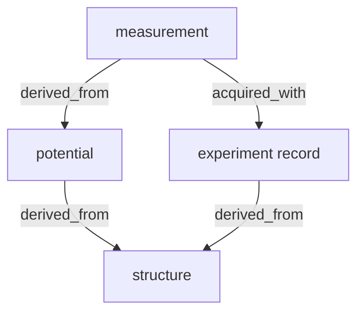

# abTEM ↔ Dataerai — experiment provenance integration

`abtem.dataerai` preserves every artifact of an abTEM virtual experiment as a
versioned asset on a [Dataerai](https://dataerai.com) server and links the
artifacts into a single provenance graph, so a simulated measurement can always
be traced back to the exact structure, potential, illumination, scan, detector
configuration, and software environment that produced it.

The integration is **optional and self-degrading**: without the `dataerai-sdk`
package or server credentials everything still works — the full provenance
record is written locally (JSON manifest + human-readable `PROVENANCE.md` with
a mermaid diagram) and uploads are marked as skipped.

## Quick start

```python
import ase.build
import abtem
from abtem import dataerai

atoms = ase.build.bulk("Si", cubic=True) * (2, 2, 4)

with dataerai.track(name="Si-110 HAADF", directory="runs") as experiment:
    experiment.capture_structure(atoms)

    potential = abtem.Potential(atoms, sampling=0.1, slice_thickness=2)
    probe = abtem.Probe(energy=200e3, semiangle_cutoff=20)
    scan = abtem.GridScan(sampling=probe.aperture.nyquist_sampling)
    detector = abtem.AnnularDetector(inner=65, outer=200)

    experiment.capture_potential(potential)
    experiment.capture_illumination(probe)
    experiment.capture_scan(scan)
    experiment.capture_detector(detector)

    measurement = probe.scan(potential, scan=scan, detectors=detector).compute()

    experiment.capture_measurement(measurement, name="haadf")
```

While a tracked experiment is active, any `to_zarr(...)` call on an abTEM
array object (waves, potential arrays, measurements) is **captured
automatically** — explicit `capture_measurement` calls are only needed for
outputs you do not save yourself.

Run `python -m abtem.dataerai selftest` for an offline end-to-end check.

## Provenance model

Each captured artifact becomes a *node* (and, when uploads are enabled, a
Dataerai asset). Nodes are linked with directed edges pointing **from the
derived artifact to its origin**, following the Dataerai asset-relationship
convention:



| node role      | content preserved                                        |
| -------------- | -------------------------------------------------------- |
| `structure`    | `ase.Atoms` as `.extxyz` + formula/cell/pbc + positions hash |
| `potential`    | full constructor parameters (parametrization, slicing, …) |
| `illumination` | `Probe`/`PlaneWave`/`SMatrix` parameters (energy, aperture, aberrations) |
| `scan`         | `GridScan`/`LineScan`/`CustomScan` parameters            |
| `detector`     | detector parameters (angular ranges, …)                  |
| `experiment`   | run record: all of the above + environment snapshot (abTEM/numpy/dask/ase versions, platform) |
| `measurement`  | computed data as a Zarr zip store + axes/metadata dict    |

Parameter capture is generic: any abTEM component (`CopyMixin` subclass)
is serialized through its constructor signature (`_copy_kwargs`), recursively
converting nested components, `ase.Atoms`, distributions, and NumPy values to
plain JSON.

## Delivery layers (graceful degradation)

1. **Local manifest — always.** `provenance_manifest.json` + `PROVENANCE.md`
   in the run directory. The manifest alone fully describes the experiment.
2. **Preservation — when available.** Each node's payload file is uploaded as
   a Dataerai asset via the `dataerai` SDK (backed by the local
   `dataerai-transfer` daemon which holds OAuth credentials). Tagged
   `abtem`, `abtem-run:<run_id>`, `abtem-role:<role>`.
3. **Lineage — when available.** Edges are created with the SDK's
   `create_relationship` when present, otherwise directly against the REST
   endpoint `POST /api/assets/<id>/relationships/` using a bearer token from
   the macOS Keychain (`security find-generic-password -s dataerai`) or
   `~/Library/Application Support/dataerai/credentials`.
4. **Dry run.** No SDK/credentials, or `DATAERAI_DRY_RUN=1`: layers 2–3 are
   skipped, every node records `"uploaded": false`, and the manifest is still
   complete.

## Configuration

| environment variable   | meaning                                          |
| ---------------------- | ------------------------------------------------ |
| `DATAERAI_SERVER`      | server base URL (default `https://beta.dataerai.com`) |
| `DATAERAI_PROJECT_ID`  | project UUID that owns the created assets        |
| `DATAERAI_OWNER_TYPE`  | `project` (default) or `user`                    |
| `DATAERAI_DRY_RUN`     | `1` forces offline mode                          |
| `DATAERAI_TOKEN`       | bearer token override (else keychain/credentials file) |

Install the optional dependency with `pip install abTEM[dataerai]`.
