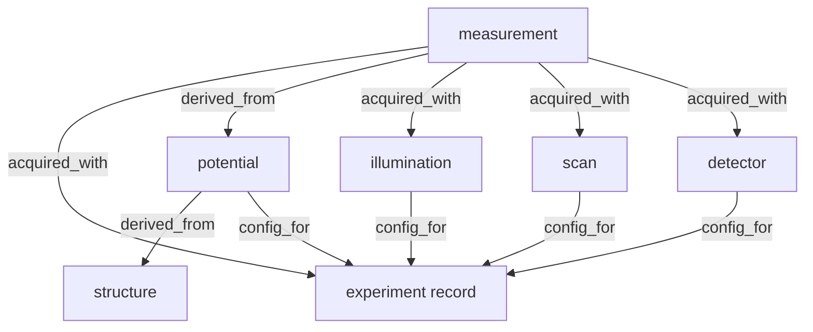

# abTEM ↔ Dataerai — experiment provenance integration

`abtem.dataerai` preserves every artifact of an abTEM virtual experiment as a
versioned asset on a [Dataerai](https://dataerai.com) server and links the
artifacts into a single provenance graph, so a simulated measurement can always
be traced back to the exact structure, potential, illumination, scan, detector
configuration, and software environment that produced it.

The integration is **optional and self-degrading**: without the `dataerai-sdk`
package or server credentials everything still works — the full provenance
record is written locally (JSON manifest + human-readable `PROVENANCE.md` with
a mermaid diagram) and uploads are marked as skipped.

## Quick start

```python
import ase.build
import abtem
from abtem import dataerai

atoms = ase.build.bulk("Si", cubic=True) * (2, 2, 4)

with dataerai.track(name="Si HAADF", directory="runs") as experiment:
    experiment.capture_structure(atoms)

    potential = abtem.Potential(atoms, sampling=0.05, slice_thickness=2)
    probe = abtem.Probe(energy=200e3, semiangle_cutoff=20)
    scan = abtem.GridScan(start=(0, 0), end=potential.extent, sampling=0.25)
    detector = abtem.AnnularDetector(inner=65, outer=200)

    experiment.capture_potential(potential)
    experiment.capture_illumination(probe)
    experiment.capture_scan(scan)
    experiment.capture_detector(detector)

    measurement = probe.scan(potential, scan=scan, detectors=detector).compute()

    experiment.capture_measurement(measurement, name="haadf")
```

The type-dispatching shorthand `dataerai.capture(obj)` routes any supported
object (`ase.Atoms`, potentials, probes/plane waves/S-matrices, scans,
detectors, frozen phonons, computed array objects, or existing files) to the
right capture method of the active experiment.

While a tracked experiment is active, any `to_zarr(...)` save of an abTEM
array object is **captured automatically** — explicit `capture_measurement`
calls are only needed for outputs you do not save yourself. Disable with
`track(..., autocapture=False)`.

Run `python -m abtem.dataerai selftest` for an offline end-to-end check (a
miniature tracked STEM simulation); add `--live` to deliver it to a real
server using your ambient credentials.

## Provenance model

Each captured artifact becomes a *node* (and, when delivery is enabled, a
Dataerai asset). Edges point **from the derived artifact to its origin**,
following the Dataerai asset-relationship convention:



| node role      | content preserved                                          | asset record type |
| -------------- | ---------------------------------------------------------- | ----------------- |
| `structure`    | `ase.Atoms` as `.extxyz` + formula/cell/pbc + content hash | `sample_specimen` |
| `sample`       | `FrozenPhonons`/ensemble parameters (also `derived_from` the structure) | `protocol_workflow` |
| `potential`    | full constructor parameters (parametrization, slicing, …)  | `protocol_workflow` |
| `illumination` | `Probe`/`PlaneWave`/`SMatrix` parameters (energy, aperture, aberrations) | `protocol_workflow` |
| `scan`         | `GridScan`/`LineScan`/`CustomScan` parameters              | `protocol_workflow` |
| `detector`     | detector parameters (angular ranges, …)                    | `protocol_workflow` |
| `experiment`   | run record: components + environment snapshot (abTEM/numpy/dask/ase versions, platform) | `simulation` |
| `measurement`  | computed data as a Zarr zip store + axes/metadata dict     | `imaging` / `diffraction_scattering` / `dataset` |

Relationship verbs come from the Dataerai relationship vocabulary
(`derived_from`, `config_for`) plus `acquired_with`, the convention shared
with the QICK instrument integration (the server accepts free-form verbs).

Parameter capture is generic: any abTEM component (`CopyMixin` subclass) is
serialized through its constructor signature, recursively converting nested
components, `ase.Atoms`, distributions, and NumPy/dask values to plain JSON.
Every payload carries a SHA-256 content hash in the manifest.

## Delivery layers (graceful degradation)

1. **Local manifest — always.** `provenance_manifest.json` + `PROVENANCE.md`
   in the run directory. The manifest alone fully describes the experiment.
2. **Preservation — when available.** Each node's payload file is uploaded as
   a Dataerai asset via the `dataerai` SDK (backed by the local
   `dataerai-transfer` daemon, which holds the OAuth credentials). Assets are
   owned by `DATAERAI_PROJECT_ID` when set, else by the authenticated user,
   and tagged `abtem-dataerai`, `abtem-run:<run_id>`, `abtem-role:<role>`.
3. **Lineage — when available.** Edges are created with the SDK's
   `create_relationship`; with an SDK predating it, the integration falls
   back to the REST endpoint (`POST /api/assets/<id>/relationships/`) using a
   bearer token from `DATAERAI_TOKEN`, the macOS Keychain
   (`security find-generic-password -s dataerai -a auth`), or the daemon's
   credentials file. Already-existing edges are treated as success.
4. **Dry run.** No SDK/credentials, or `DATAERAI_DRY_RUN=1`: layers 2–3 are
   skipped, every node records its skip reason, and the manifest is still
   complete.

A failed experiment (an exception inside `track()`) still finalizes: the
manifest is written with `"status": "failed"` and the exception re-raised.

## Configuration

| environment variable        | meaning                                          |
| --------------------------- | ------------------------------------------------ |
| `DATAERAI_SERVER`           | server base URL for the REST fallback (default `https://beta.dataerai.com`) |
| `DATAERAI_PROJECT_ID`       | project UUID that owns the created assets        |
| `DATAERAI_OWNER_TYPE`       | `project` (default) or `user`                    |
| `DATAERAI_DRY_RUN`          | `1` forces offline mode, `0` forces live mode    |
| `DATAERAI_TOKEN`            | bearer token override for the REST fallback      |
| `DATAERAI_CREDENTIALS_FILE` | alternative credentials file location            |

Install the optional dependency with `pip install "abTEM[dataerai]"`; the SDK
uploads through the local `dataerai-transfer` daemon (`dataerai auth login`
to authenticate it).
